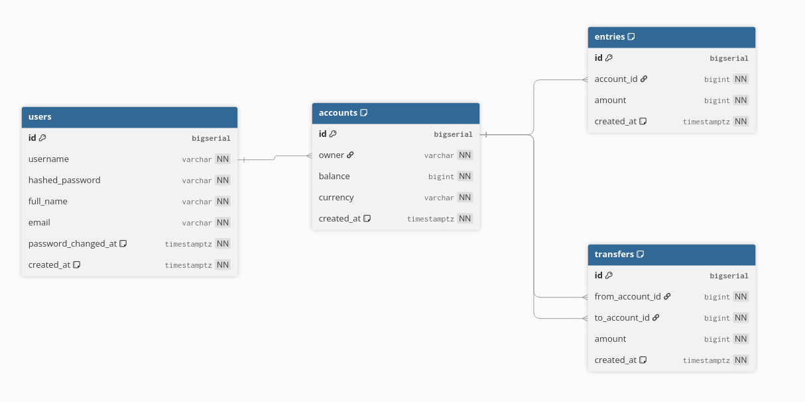

# Simple Bank - Go Banking Application


A complete banking application built with Go featuring:

- REST & gRPC APIs
- JWT/PASETO authentication
- PostgreSQL database
- Kubernetes deployment

## 🚀 Features

### Core Functionality

- User registration & authentication
- Bank account management
- Money transfers between accounts
- Transaction history

### Technical Features

- ✅ REST API (Gin framework)
- ✅ gRPC API
- ✅ SQLC for type-safe SQL queries
- ✅ Database migrations
- ✅ JWT & PASETO token support
- ✅ Kubernetes deployment (EKS)
- ✅ Unit tests

## Architecture Overview

```
┌─────────────────┐    ┌─────────────────┐
│   REST Client   │    │   gRPC Client   │
└─────────┬───────┘    └─────────┬───────┘
          │                      │
          ▼                      ▼
┌─────────────────┐    ┌─────────────────┐
│   Gin Server    │    │   gRPC Server   │
│   (Port 8080)   │    │   (Port 9090)   │
└─────────┬───────┘    └─────────┬───────┘
          │                      │
          └──────────┬───────────┘
                     ▼
           ┌─────────────────┐
           │   Store Layer   │
           │   (SQLC)        │
           └─────────┬───────┘
                     ▼
           ┌─────────────────┐
           │   PostgreSQL    │
           │   Database      │
           └─────────────────┘
```

📊 Database Schema
The application uses a simple but effective schema with the following main entities:

Users: User authentication and profile information
Accounts: Bank accounts with currency and balance
Entries: Account balance change records
Transfers: Money transfer records between accounts



## 📂 Project Structure

```
simple-bank/
├── 📁 api/ # REST API implementation
│ ├── account.go # Account CRUD handlers
│ ├── account_test.go # Account endpoint tests
│ ├── middleware.go # Authentication middleware
│ ├── middleware_test.go # Middleware tests
│ ├── server.go # HTTP server setup & routing
│ ├── transfer.go # Money transfer handlers
│ ├── user.go # User authentication handlers
│ ├── user_test.go # User endpoint tests
│ └── validator.go # Request validation logic
│
├── 📁 db/ # Database layer
│ ├── 📁 migration/ # SQL migration files
│ │
│ ├── 📁 mock/ # Mock database for testing
│ │ └── store.go # Mock store implementation
│ │
│ ├── 📁 query/ # SQL query files
│ │ ├── account.sql # Account queries
│ │ ├── entry.sql # Transaction entry queries
│ │ ├── transfer.sql # Transfer queries
│ │ └── user.sql # User queries
│ │
│ └── 📁 sqlc/ # SQLC generated Go code
│ ├── account.sql.go # Generated account queries
│ ├── entry.sql.go # Generated entry queries
│ ├── transfer.sql.go # Generated transfer queries
│ ├── user.sql.go # Generated user queries
│ ├── db.go # Database connection & transactions
│ ├── models.go # Database models
│ └── store.go # Store interface & implementation
│
├── 📁 gapi/ # gRPC API implementation
│ ├── server.go # gRPC server setup
│ ├── rpc_create_user.go # CreateUser RPC handler
│ ├── rpc_login_user.go # LoginUser RPC handler
│ └── converter.go # Proto to model converters
│
├── 📁 pb/ # Generated protobuf code
│ └── ... # Generated .pb.go files
│
├── 📁 proto/ # Protocol buffer definitions
│ ├── rpc_create_user.proto # CreateUser RPC definition
│ ├── rpc_login_user.proto # LoginUser RPC definition
│ ├── service_simple_bank.proto # Main service definition
│ └── user.proto # User message definitions
│
├── 📁 token/ # Token management
│ ├── jwt_maker.go # JWT token implementation
│ ├── jwt_maker_test.go # JWT tests
│ ├── paseto_maker.go # PASETO token implementation
│ ├── paseto_maker_test.go # PASETO tests
│ ├── maker.go # Token maker interface
│ └── payload.go # Token payload structure
│
├── 📁 util/ # Utility functions
│ ├── config.go # Configuration management
│ ├── currency.go # Currency validation
│ ├── password.go # Password hashing utilities
│ ├── random.go # Random data generation
│ └── testdb.go # Test database utilities
│
├── 📁 eks/ # Kubernetes deployment files
│ ├── aws-auth.yml # AWS IAM authentication config
│ ├── deployment.yml # Application deployment config
│ ├── service.yml # Kubernetes service config
│ └── ingress.yml # Ingress configuration
│
├── 📁 .github/workflows/ # GitHub Actions CI/CD
│ ├── ci.yml # Continuous integration
│ └── deploy.yml # Deployment pipeline
│
├── Dockerfile # Docker container definition
├── docker-compose.yml # Local development setup
├── Makefile # Build automation
├── go.mod # Go module definition
├── go.sum # Go module checksums
├── app.env # Environment variables template
├── sqlc.yaml # SQLC configuration
└── README.md # This file
```
